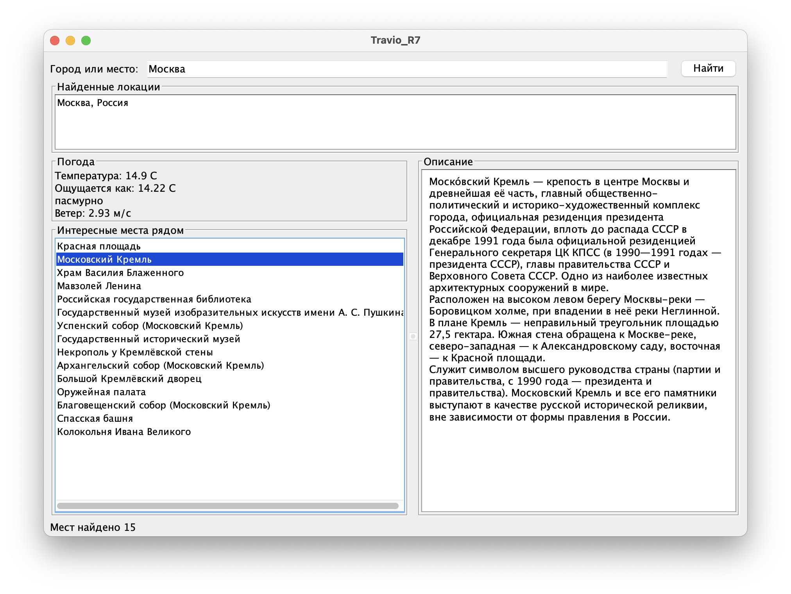

# Travio

Desktop‑приложение на Java:
вводите название города - получаете текущую погоду и список главных достопримечательностей рядом с описаниями из Википедии.



## Как это работает

1. Вы вводите название города и нажимаете «Найти».
2. Приложение находит подходящие локации (город может быть не один - например, Лондон в Англии и Лондон в Канаде) и показывает их списком.
3. Вы выбираете локацию - параллельно загружаются погода и достопримечательности.
4. Клик по достопримечательности показывает её описание.

Данные берутся из открытых источников:

| Что | Откуда |
|---|---|
| Поиск городов по названию | [Geoapify Geocoding](https://www.geoapify.com/geocoding-api/) |
| Погода | [OpenWeather](https://openweathermap.org/current) |
| Достопримечательности и описания | [Русская Википедия](https://ru.wikipedia.org/w/api.php) |
| Известность места (число языков, на которых есть статья) | [Wikidata](https://www.wikidata.org/) |


## Требования

- Java 21 или новее
- Два бесплатных API‑ключа (см. ниже)

## Получение ключей

1. **Geoapify** - зарегистрируйтесь на [myprojects.geoapify.com](https://myprojects.geoapify.com/), создайте проект и скопируйте API key.
2. **OpenWeather** - зарегистрируйтесь на [openweathermap.org](https://home.openweathermap.org/users/sign_up), ключ появится в разделе [API keys](https://home.openweathermap.org/api_keys).
   Новый ключ начинает работать через 10 минут после создания.


## Настройка ключей

Приложение ищет ключи в двух местах, по порядку:

1. **Переменные окружения** `GEOAPIFY_KEY` и `OPENWEATHER_KEY`.
2. **Файл `.env`** в папке, из которой запущено приложение:

   ```
   GEOAPIFY_KEY=ваш_ключ
   OPENWEATHER_KEY=ваш_ключ
   ```

Переменные окружения имеют приоритет над файлом. Если ключ не найден нигде, приложение покажет окно с сообщением какой ключ отсутствует и завершится.


## Запуск

### Из исходников

```bash
git clone https://github.com/rodio967/TravioService.git
cd TravioService
# создайте .env с ключами (см. выше)
./gradlew run
```

На Windows вместо `./gradlew` используйте `gradlew.bat`.

### Готовый JAR

Соберите JAR со всеми зависимостями:

```bash
./gradlew fatJar
```

Файл появится в `build/libs/travio-1.0-SNAPSHOT-all.jar`.

```bash
java -jar build/libs/travio-1.0-SNAPSHOT-all.jar
```


Архитектурные решения:

- **Все запросы асинхронные** - клиенты возвращают `CompletableFuture`, интерфейс не блокируется. Погода и достопримечательности загружаются параллельно.
- **MVP в UI** - `MainPresenter` не зависит от Swing и работает с `MainView` через интерфейс; обновления экрана выполняются в UI‑потоке через переданный `Executor`.
- **Один класс - один внешний API** - заменить источник погоды или достопримечательностей можно, реализовав соответствующий интерфейс и подставив его в `Main`.

## Ограничения

- Работает только с русской Википедией: место без статьи в ru‑wiki в список не попадёт.
- Wikipedia API ограничивает частоту запросов по IP. При очень частых кликах возможно сообщение «сервис временно ограничил запросы» - немного подождите и повторите.

## Технологии

Java 21 · Swing · Jackson · Gradle
